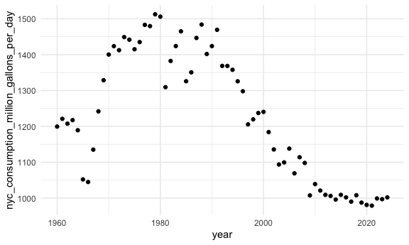

reading_data_from_the_web
================
Kino Watanabe
2025-10-09

``` r
library(tidyverse)
```

    ## ── Attaching core tidyverse packages ──────────────────────── tidyverse 2.0.0 ──
    ## ✔ dplyr     1.1.4     ✔ readr     2.1.5
    ## ✔ forcats   1.0.0     ✔ stringr   1.5.1
    ## ✔ ggplot2   3.5.2     ✔ tibble    3.3.0
    ## ✔ lubridate 1.9.4     ✔ tidyr     1.3.1
    ## ✔ purrr     1.1.0     
    ## ── Conflicts ────────────────────────────────────────── tidyverse_conflicts() ──
    ## ✖ dplyr::filter() masks stats::filter()
    ## ✖ dplyr::lag()    masks stats::lag()
    ## ℹ Use the conflicted package (<http://conflicted.r-lib.org/>) to force all conflicts to become errors

``` r
library(rvest)
```

    ## 
    ## Attaching package: 'rvest'
    ## 
    ## The following object is masked from 'package:readr':
    ## 
    ##     guess_encoding

``` r
library(httr)

knitr::opts_chunk$set(
  fig.width = 6,
  fig.asp = .6,
  out.width = "90%"
)

theme_set(theme_minimal() + theme(legend.position = "bottom"))

options(
  ggplot2.continuous.colour = "viridis",
  ggplot2.continuous.fill = "viridis"
)

scale_colour_discrete = scale_colour_viridis_d
scale_fill_discrete = scale_fill_viridis_d
```

# Import NSDOH data from the web

``` r
url = "http://samhda.s3-us-gov-west-1.amazonaws.com/s3fs-public/field-uploads/2k15StateFiles/NSDUHsaeShortTermCHG2015.htm"
drug_use_html = read_html(url)

drug_use_html
```

    ## {html_document}
    ## <html lang="en">
    ## [1] <head>\n<link rel="P3Pv1" href="http://www.samhsa.gov/w3c/p3p.xml">\n<tit ...
    ## [2] <body>\r\n\r\n<noscript>\r\n<p>Your browser's Javascript is off. Hyperlin ...

### This is an “easy” case

- `html_table()` pulls out everything in html that is marked as table

``` r
ndsuh_df = 
drug_use_html |>
  html_table() |> 
  first()
```

``` r
ndsuh_df = 
drug_use_html |>
  html_table() |> 
  nth(1) |> 
  slice(-1)
```

- pulls every table in the url
- `slice` takes off specific rows
  - “note” at the bottom of the table appears in every column in the
    first row
- need to clean up “a, b, etc” and columns are encoding 2 different
  variables (age, year)

### Slightly harder case

- none of this info is in tables –\> **css selector**

``` r
swm_html = 
  read_html("https://www.imdb.com/list/ls070150896/")
```

### Now pull out the elements I care about – use selector gadget

``` r
title_vec = 
  swm_html |>
  html_elements(".ipc-title-link-wrapper .ipc-title__text") |>
  html_text()

metascore_vec = 
  swm_html |>
  html_elements(".metacritic-score-box") |>
  html_text()

runtime_vec = 
  swm_html |>
  html_elements(".dli-title-metadata-item:nth-child(2)") |>
  html_text()

swm_df = 
  tibble(
    title = title_vec,
    score = metascore_vec,
    runtime = runtime_vec)
```

# APIs

Get data from APIs

NYC water consumption dataset

``` r
nyc_water = 
  GET("https://data.cityofnewyork.us/resource/ia2d-e54m.csv") |> 
  content("parsed") 
```

    ## Rows: 65 Columns: 4
    ## ── Column specification ────────────────────────────────────────────────────────
    ## Delimiter: ","
    ## dbl (4): year, new_york_city_population, nyc_consumption_million_gallons_per...
    ## 
    ## ℹ Use `spec()` to retrieve the full column specification for this data.
    ## ℹ Specify the column types or set `show_col_types = FALSE` to quiet this message.

``` r
nyc_water |> 
  ggplot(aes(x = year, y = nyc_consumption_million_gallons_per_day)) + 
    geom_point()
```



``` r
brfss_smart2010 = 
  GET("https://chronicdata.cdc.gov/resource/acme-vg9e.csv",
      query = list("$limit" = 5000)) |> 
  content("parsed")
```

    ## Rows: 5000 Columns: 23
    ## ── Column specification ────────────────────────────────────────────────────────
    ## Delimiter: ","
    ## chr (16): locationabbr, locationdesc, class, topic, question, response, data...
    ## dbl  (6): year, sample_size, data_value, confidence_limit_low, confidence_li...
    ## lgl  (1): locationid
    ## 
    ## ℹ Use `spec()` to retrieve the full column specification for this data.
    ## ℹ Specify the column types or set `show_col_types = FALSE` to quiet this message.

- `query = list ("app_token" = xxxxxxxxxxxx))`

Pokemon data

``` r
poke = 
  GET("http://pokeapi.co/api/v2/pokemon/1") |>
  content()

poke[["name"]]
```

    ## [1] "bulbasaur"

``` r
poke[["height"]]
```

    ## [1] 7

``` r
poke[["abilities"]]
```

    ## [[1]]
    ## [[1]]$ability
    ## [[1]]$ability$name
    ## [1] "overgrow"
    ## 
    ## [[1]]$ability$url
    ## [1] "https://pokeapi.co/api/v2/ability/65/"
    ## 
    ## 
    ## [[1]]$is_hidden
    ## [1] FALSE
    ## 
    ## [[1]]$slot
    ## [1] 1
    ## 
    ## 
    ## [[2]]
    ## [[2]]$ability
    ## [[2]]$ability$name
    ## [1] "chlorophyll"
    ## 
    ## [[2]]$ability$url
    ## [1] "https://pokeapi.co/api/v2/ability/34/"
    ## 
    ## 
    ## [[2]]$is_hidden
    ## [1] TRUE
    ## 
    ## [[2]]$slot
    ## [1] 3
